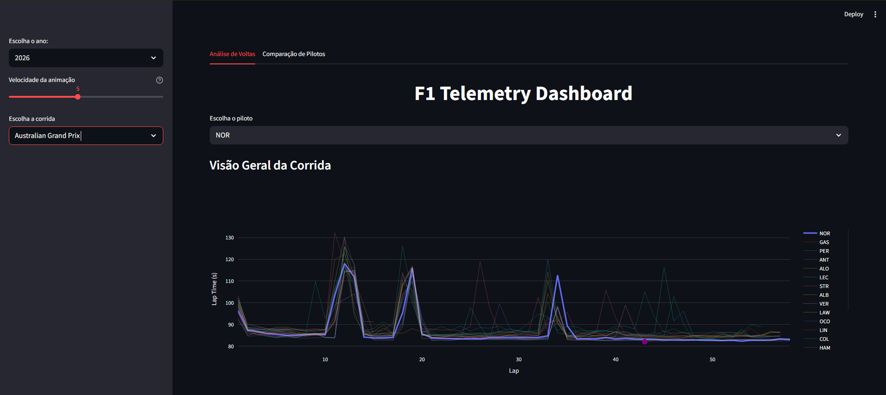
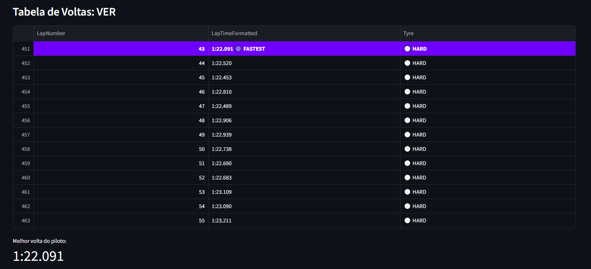
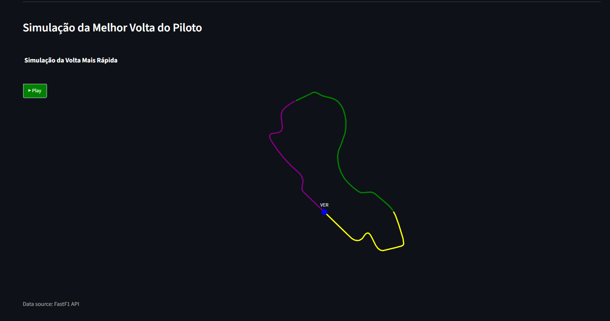
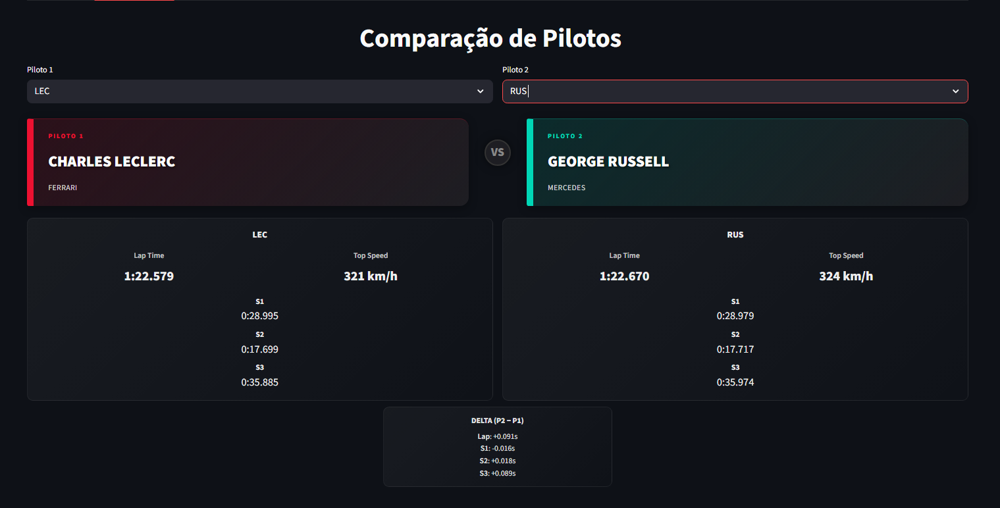
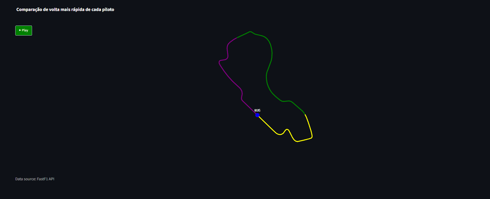
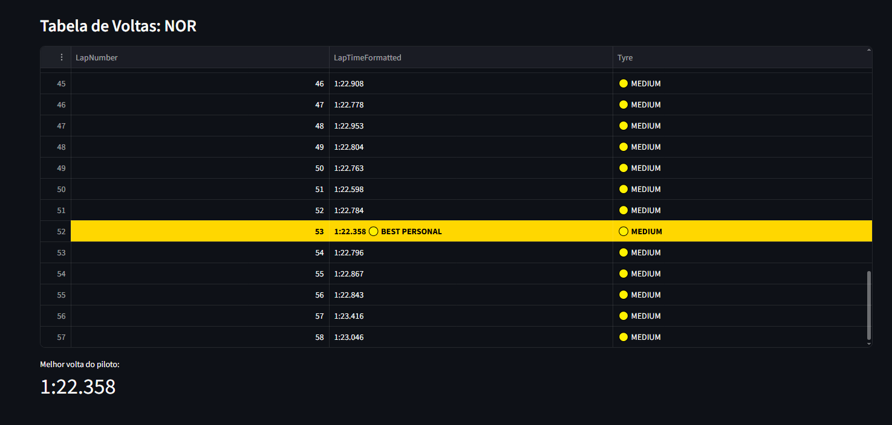

# F1 Telemetry Dashboard (Streamlit)

Dashboard interativo em **Streamlit** para análise de voltas e comparação de pilotos usando dados da **FastF1**.

## Demo








## Funcionalidades

- **Análise de voltas**: visão geral da corrida e tabela de voltas por piloto.
- **Métrica de melhor volta** do piloto selecionado.
- **Simulação animada** do traçado da melhor volta.
- **Comparação de pilotos**: animação lado a lado com interpolação temporal.
- **Controle de performance**: slider para ajustar a qualidade/peso das animações.

## Stack

- Python
- Streamlit
- FastF1
- Pandas / NumPy
- Plotly

## Como rodar (Windows)

Crie e ative um ambiente virtual:

```bash
python -m venv .venv
.venv\Scripts\activate
```

Instale as dependências:

```bash
pip install -r requirements.txt
```

Execute o app:

```bash
streamlit run app.py
```

Na primeira execução, o FastF1 pode demorar um pouco mais por causa de cache/download de dados.

## Dica de performance

- Se a animação ficar pesada, diminua **“Qualidade da animação”** na sidebar (ex.: 300–400).

## Troubleshooting (rápido)

- Se der erro de download/cache, apague a pasta `cache/` e rode de novo.
- Se o app ficar lento, reduza o slider de qualidade da animação.
- Se `streamlit` não for encontrado, confirme que o venv está ativo.

## Estrutura do projeto

- `app.py`: interface Streamlit (sidebar, abas, chamadas de processamento e plots).
- `src/data_loader.py`: integração com FastF1 (cache e carregamento de sessões/calendário).
- `src/processing.py`: preparação de dados de voltas e extração de telemetria da volta mais rápida.
- `src/simulation.py`: interpolação da telemetria para animação (base temporal).
- `src/plots.py`: gráficos e animações com Plotly + tabela estilizada.
- `src/ui_components.py`: Responsável por componentes visuais reutilizáveis do dashboard.


## Dados

- Fonte: FastF1 (API/biblioteca).


